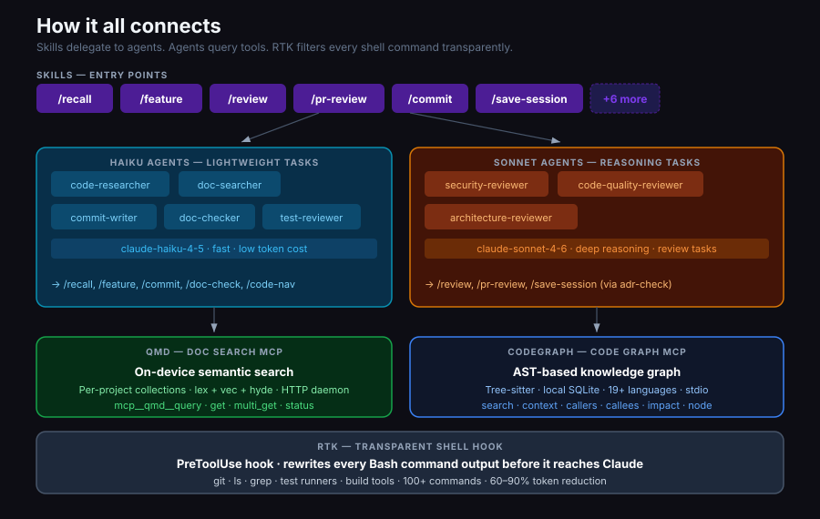

# Tools

Deep dive on each tool in the stack.

---

## How it all connects

The four tools form a stack. Skills and agents sit on top and wire them together.

```
┌─────────────────────────────────────────────────────────┐
│                        Skills                           │
│  /recall  /feature  /review  /commit  /save-session … │
└──────────┬─────────────────────────┬────────────────────┘
           │ delegates to            │ calls
┌──────────▼──────────┐  ┌──────────▼──────────────────┐
│       Agents        │  │       spec-kit phases        │
│  (Haiku / Sonnet)   │  │  specify / plan / tasks      │
└──────────┬──────────┘  └─────────────────────────────┘
           │ uses
┌──────────▼────────────────────────────────────────────┐
│                   MCP Tools                           │
│        QMD (docs)        Codegraph (code)             │
└──────────────────────────────────────────────────────┘
           +
┌─────────────────────────────────────────────────────┐
│              RTK (transparent shell hook)           │
│       rewrites every Bash call before it runs       │
└─────────────────────────────────────────────────────┘
```

**Skills** are the entry points — slash commands you run. They orchestrate the flow but keep the main context clean by delegating work to agents.

**Agents** are subprocesses with a focused job and a specific model. Lightweight tasks (search, commit message, doc check) use **Haiku** to save tokens. Review and reasoning tasks use **Sonnet**.

**MCP tools** (QMD and Codegraph) run as servers that Claude queries instead of reading files. They're always available — Claude uses them automatically when `CLAUDE.md` instructs it to.

**RTK** operates at the shell layer — completely invisible to Claude, it filters every command output before it reaches the context.



---

## QMD — On-device semantic search

**Repo:** https://github.com/tobi/qmd  
**What it is:** A local search engine over markdown files. Runs entirely on your machine with locally downloaded embedding models. No external API calls, no data leaves your machine.

### How it works

QMD organises content into named **collections**. Each collection points to a directory of markdown files. When you run `qmd embed`, it generates vector embeddings and stores them in a local SQLite database at `~/.cache/qmd/index.sqlite`.

Claude connects to QMD via MCP. In this setup, QMD runs as an HTTP daemon at `http://localhost:8181/mcp` (started automatically at login via launchd).

### Three search modes

| Mode | How | Use when |
|------|-----|----------|
| `lex` | BM25 keyword search | You know the exact term |
| `vec` | Semantic vector search | You want similar meaning, not exact words |
| `hyde` | Hypothetical document | You describe what the answer looks like |

Best results combine `lex` + `vec` in the same query.

### Per-project setup

Each project gets its own named collection:

```bash
qmd collection add ./docs --name my-project --mask "**/*.md"
qmd embed
```

The `/setup-qmd` skill does this automatically and writes the collection name to the local `CLAUDE.md`.

### CLI reference

```bash
qmd collection list          # show all collections
qmd collection add <path> --name <name>
qmd embed                    # generate/update embeddings
qmd ls <collection>          # browse files in a collection
qmd mcp --http --daemon      # start HTTP MCP server
```

---

## RTK — Rust Token Killer

**Repo:** https://github.com/rtk-ai/rtk  
**What it is:** A transparent proxy that rewrites Claude Code shell commands to filter noise and reduce token usage 60–90%.

### How it works

RTK is installed as a `PreToolUse` hook on the `Bash` matcher. Every shell command Claude runs goes through `rtk hook claude`, which applies smart filtering — removing boilerplate, truncating verbose output, deduplicating repeated lines — before the result reaches Claude.

From Claude's perspective, it just runs commands. From your token budget's perspective, `git log` goes from ~8,000 tokens to ~400.

### Zero friction

There's nothing to invoke. You never call `rtk` directly for normal work. It's entirely transparent.

```bash
rtk gain              # see accumulated token savings
rtk gain --history    # per-command savings breakdown
rtk discover          # analyse history for missed opportunities
```

### What it filters

- `git log`, `git diff`, `git status`
- `ls`, `cat`, `find`, `grep`
- Test output (jest, pytest, cargo test, go test)
- Build output (tsc, eslint, cargo build)
- Docker and kubectl output
- npm/pip/cargo package manager output

---

## Codegraph — AST code knowledge graph

**Repo:** https://github.com/colbymchenry/codegraph  
**What it is:** Builds a local SQLite graph of your codebase using tree-sitter AST parsing. Exposed to Claude as an MCP stdio server.

### How it works

On `codegraph init`, it parses all source files and extracts symbols (functions, classes, methods, variables) and their relationships (calls, imports, inheritance). The result is a queryable graph stored in `.codegraph/` in your project root.

File watchers keep the graph in sync automatically as you edit.

### MCP tools Claude uses

| Tool | What it does |
|------|-------------|
| `codegraph_search` | Find symbols by name |
| `codegraph_context` | Get relevant code context for a task |
| `codegraph_callers` | What calls this function? |
| `codegraph_callees` | What does this function call? |
| `codegraph_impact` | What breaks if I change this? |
| `codegraph_node` | Details for a specific symbol |

### Why it matters

Without Codegraph, Claude reads files to understand code — expensive, slow, and context-heavy. With Codegraph, Claude queries the graph. 70% fewer tool calls, 59% fewer tokens, meaningfully faster responses on large codebases.

### Per-project setup

```bash
codegraph init -i    # interactive setup, auto-detects Claude Code
```

### Supported languages

TypeScript, JavaScript, Python, Go, Rust, Java, C#, PHP, Ruby, C, C++, Swift, Kotlin, Dart, Svelte, Vue — 19+ languages.

---

## Spec-kit — Spec-driven feature development

**Repo:** https://github.com/github/spec-kit  
**What it is:** A methodology and toolset for writing specifications before writing code. Installs as a Claude Code plugin with slash commands for each phase.

### Philosophy

Spec-Driven Development (SDD) inverts the usual flow. You define *what* and *why* before touching code. The specification becomes the primary artefact — code is derived from it, not the other way around.

### Phases

| Phase | Command | Output |
|-------|---------|--------|
| Specify | `/speckit.specify` | `spec.md` with user stories and acceptance criteria |
| Clarify | `/speckit.clarify` | Resolves ambiguities in the spec |
| Checklist | `/speckit.checklist` | Quality validation of the spec |
| Plan | `/speckit.plan` | `plan.md`, `research.md`, `data-model.md`, `contracts/` |
| Tasks | `/speckit.tasks` | `tasks.md` with phased, dependency-ordered work |
| Implement | `/speckit.implement` | Executes tasks to build the feature |

### The `/feature` skill

The `/feature` skill wraps the early phases (specify → plan, optionally → tasks). It asks you three questions upfront and then orchestrates the workflow. See [workflow.md](./workflow.md) for the full flow.

### Artifacts stay local

`.specify/` and `specs/` are always added to `.gitignore`. Specs don't go to the repo — they're your working notes, not deliverables.

### Install

Spec-kit installs as a Claude Code plugin:

```bash
claude plugin install github/spec-kit
```
