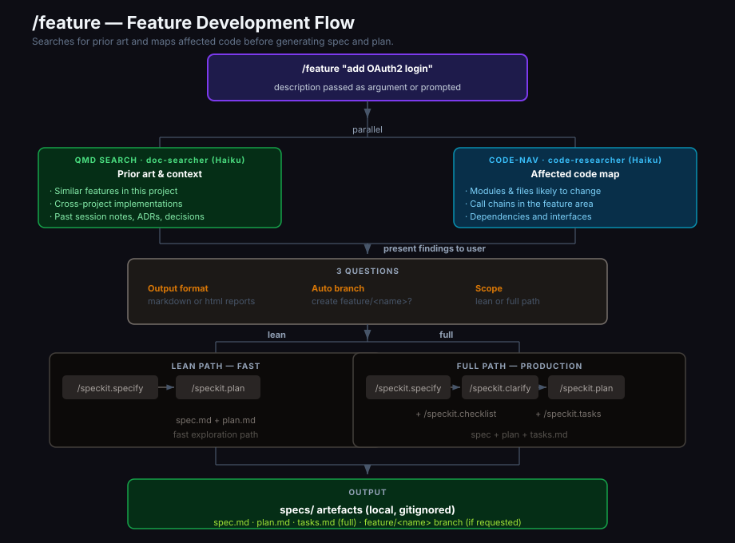
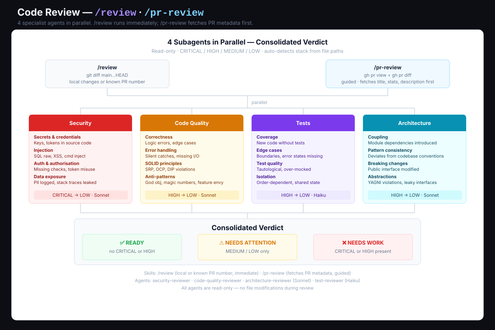

# Workflow

How a typical dev session looks with this setup.

---

## Session start

```
/recall
```

Always start here. Searches QMD for relevant context — architecture decisions, past session summaries, anything in the project docs. Claude loads this context before you write a single message.

If `/recall` reports no collection configured, run `/project-setup` first.

---

## Building a new feature



```
/feature "add OAuth2 login with GitHub"
```

Before spec-kit runs, `/feature`:
1. Searches QMD for prior art — both in the current project and personal collections
2. Uses `code-researcher` to map files and modules likely affected

Then asks three questions:
1. **Output format** — `markdown` (just `.md` files) or `html` (HTML reports + `.md`)
2. **Auto branches/commits** — create a `feature/<name>` branch automatically?
3. **Scope** — `lean` (specify → plan) or `full` (specify → clarify → checklist → plan → tasks)

Artefacts land in `specs/<feature-name>/`:
- `spec.md` — what you're building and why, with acceptance criteria
- `plan.md` — technical approach, data model, contracts
- `tasks.md` — phased task breakdown, dependency-ordered

None of this goes to the repo — `specs/` is gitignored.

---

## Writing code

No special commands. Claude uses Codegraph automatically (enforced in `CLAUDE.md`).

What this means in practice:
- Claude searches for a function → `codegraph_search`, not `grep`
- Claude traces a call chain → `codegraph_callers`, not reading files
- Claude estimates impact of a change → `codegraph_impact`

To find something specific without touching the main context:
```
/code-nav "where is the rate limiter middleware defined?"
```

---

## Reviewing changes



Two skills, same agents, different entry points:

| | `/review` | `/pr-review` |
|---|---|---|
| **Use when** | You want results fast, local or known PR | You want to see PR metadata first |
| **Entry** | Runs immediately | Asks for PR, shows title/stats, then runs |
| **Output** | Same verdict format | Same verdict format |

```bash
/review              # local staged changes
/review 42           # PR #42, no preview
/pr-review           # asks for PR, shows context first
```

All three use the same 4 agents in parallel: `security-reviewer`, `code-quality-reviewer`, `test-reviewer`, `architecture-reviewer`.

Verdict format:
```
SECURITY        [✅/⚠️/❌]  summary
CODE QUALITY    [✅/⚠️/❌]  summary
TESTS           [✅/⚠️/❌]  summary
ARCHITECTURE    [✅/⚠️/❌]  summary

VERDICT: ✅ READY | ⚠️ NEEDS ATTENTION | ❌ NEEDS WORK
```

---

## Committing

```
/commit
```

Staged diff → Conventional Commits message. Edit if needed, then `git commit`.

Format: `type(scope): description`

Types: `feat`, `fix`, `refactor`, `docs`, `test`, `chore`, `perf`, `ci`

---

## Checking docs

```
/doc-check
```

After a refactor or feature, checks which docs are now stale given the branch changes.

---

## Documenting decisions (ADRs)

Architecture Decision Records capture *why* a choice was made — the context, the tradeoffs, the alternatives considered. They're worth writing when you add a dependency, change an approach, or decide NOT to do something obvious.

### Automatic detection

`/save-session` runs `/adr-check` automatically before saving. It scans the diff for signals:

- **Strong signals** (almost always an ADR): new dependency, framework change, new external integration, new architectural pattern
- **Moderate signals**: auth strategy change, protocol change, new directory conventions

If candidates are found, it presents them and asks which to document before saving the session.

### Manual check

```
/adr-check
```

Run this any time — after a significant refactor, before a PR, or mid-session when you know a decision was made.

### Writing an ADR

```
/adr
```

The `adr` skill (from the built-in plugin) creates a structured ADR in `docs/adr/`. It prompts for context, decision, consequences, and alternatives considered.

ADRs in `docs/adr/` are **committed** — they're project documentation, not local context.

### ADR format

```
docs/adr/
└── 001-<short-title>.md
    ├── Context
    ├── Decision
    ├── Consequences
    └── Alternatives considered
```

---

## Ending a session

```
/save-session auth-refactor
```

Flow:
1. Runs `/adr-check` first — scans the diff for undocumented decisions and asks if you want to write them now
2. Any ADRs written are included in the session summary
3. Saves `docs/sessions/YYYY-MM-DD-<topic>.md`
4. Indexes `docs/sessions/` and `specs/` into QMD and re-embeds

Next time you run `/recall`, the session summary is searchable.

> **`docs/sessions/` is gitignored** — session summaries are local context, never committed.

---

## Per-project setup

Run once when starting on a new project:

```
/project-setup
```

This single command:
1. Creates `docs/sessions/`, `docs/adr/`, `specs/`
2. Adds `docs/sessions/`, `specs/`, `.codegraph/`, `.specify/` to `.gitignore` (safe append — never overwrites existing content)
3. Initialises Codegraph interactively
4. Runs `/setup-qmd` to index docs, sessions, and specs
5. Shows `/stats` to confirm everything is operational

### What gets created locally

```
your-project/
├── docs/
│   ├── sessions/      ← session summaries (gitignored, local only)
│   └── adr/           ← architecture decision records (committed)
├── specs/             ← spec-kit artefacts (gitignored)
├── .codegraph/        ← code graph index (gitignored)
└── .specify/          ← spec-kit config (gitignored)
```

`docs/adr/` is the only new directory that gets committed — it's where ADRs live.

### Spec-kit

`/feature` initialises spec-kit automatically on first use. No manual setup needed.

---

## Day-to-day command reference

| Situation | Command |
|-----------|---------|
| Start a session | `/recall` |
| New feature | `/feature "description"` |
| Review local changes | `/review` |
| Review known PR fast | `/review 42` |
| Review PR with context | `/pr-review` |
| Commit | `/commit` |
| Check stale docs | `/doc-check` |
| Find code | `/code-nav "question"` |
| End session | `/save-session topic` |
| Setup new project | `/project-setup` |
| Token savings report | `rtk gain` |
| Setup status | `/stats` |
